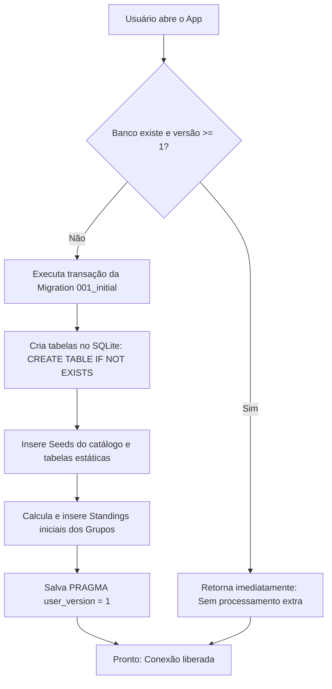

# Estudo de Caso: Migração de Mock em Memória para SQLite Local
**Popular da Copa — Documento de Estudo Acadêmico**

Este documento detalha os impactos arquiteturais, operacionais e de eficiência de memória decorrentes da substituição dos repositórios baseados em memória RAM (Mocks) por um banco de dados relacional embarcado local (**SQLite**) no ecossistema **React Native** com **Expo Router**.

---

## 1. O Problema Anterior: Redundância e Consumo de Memória (RAM Heap)

Antes da implementação do SQLite, as informações estáticas da Copa do Mundo de 2026 (48 seleções, mais de 300 jogadores e 72 partidas da fase de grupos) eram carregadas a partir de arquivos `.ts` estáticos como arrays JavaScript puros em memória:

```
+-------------------------------------------------------------+
| RAM (JavaScript Heap)                                       |
|                                                             |
|  [INITIAL_TEAMS] (~48 objetos complexos)                     |
|  [AVAILABLE_PLAYERS] (~300+ objetos com strings/imagens)    |
|  [INITIAL_MATCHES] (~72 objetos de partidas)                 |
|                                                             |
|  * Multiplicado por filtros, ordenações e cópias (spreads)  |
|    realizados a cada renderização de telas e navegação.      |
+-------------------------------------------------------------+
```

### Impactos Negativos no JS Heap:
1. **Instanciação Precoce**: Todos os dados eram parseados e carregados na memória RAM logo na inicialização do aplicativo, mesmo que o usuário nunca visitasse as telas de times ou históricos.
2. **Geração de Garbage Collection (GC)**: Métodos como `.filter()` ou `.map()` criavam novos arrays e objetos temporários na memória RAM a cada renderização. A limpeza constante destes objetos pelo coletor de lixo (Garbage Collector) causava micro-engasgos (frame drops) na interface fluida de 60fps.

---

## 2. A Solução Implementada: SQLite como Armazenamento Físico Indexado

Com a migração para o **SQLite** (via `expo-sqlite`), transferimos o armazenamento dessas estruturas de dados do espaço de execução do JavaScript (RAM) para o **disco permanente** do dispositivo do usuário (armazenamento persistente local).

```
+-----------------------------+         +-------------------------------+
| RAM (JS Heap)               |         | Armazenamento Físico (Disco)  |
|                             |         |                               |
| Apenas dados da tela ativa  | <=====> | populardacopa.db (SQLite)     |
| (Ex: 1 time + 11 jogadores) |  Query  | Tabelas indexadas: teams,     |
|                             |         | players, matches, standings   |
+-----------------------------+         +-------------------------------+
```

### Otimizações de Memória e Performance:
* **Carregamento sob Demanda (Lazy Loading)**: O aplicativo só puxa para a memória RAM os registros específicos solicitados pela tela do usuário através de queries SQL restritivas (ex: `WHERE team_id = ?`).
* **Operações de Banco Nativo**: Filtros, buscas textuais (`LIKE`) e ordenações complexas de classificação ocorrem na engine C++ nativa do SQLite, poupando a thread de execução do JavaScript.
* **Persistência Física**: O arquivo do banco é mantido no aparelho. A inicialização e inserção inicial (migrations) ocorrem apenas uma única vez na instalação do aplicativo.

---

## 3. Ciclo de Vida do Banco de Dados no Aparelho

A criação e população do banco seguem regras estritas para evitar perda de performance e reprocessamentos:



### Salvaguardas Contra Duplicação:
1. **`CREATE TABLE IF NOT EXISTS`**: Garante que o mecanismo não quebre e não recrie tabelas existentes caso o banco seja re-inicializado de forma forçada.
2. **`PRAGMA user_version`**: Funciona como um marcador permanente no arquivo `.db`. Nas inicializações de rotina (abrir o app, dar Reload em desenvolvimento ou atualizações normais do Metro), a verificação de versão faz a migration retornar antes de tentar re-processar os scripts.
3. **`INSERT OR IGNORE`**: Evita que chaves primárias duplicadas gerem falhas de integridade em caso de re-execução acidental de seeds.

---

## 4. O Rigor da Clean Architecture na Integração

Para manter as camadas limpas e testáveis, os repositórios foram implementados como classes puras em TypeScript na camada de **Infra** e instanciados via factories na camada **Main**, sem qualquer acoplamento com o React.

A conexão com o SQLite fora dos Hooks do React é resolvida por um helper singleton que abre a conexão nativamente:

```typescript
// src/shared/infra/sqlite/database.ts
import * as SQLite from 'expo-sqlite';

let dbInstance: SQLite.SQLiteDatabase | null = null;

export async function getSQLiteDb(): Promise<SQLite.SQLiteDatabase> {
  if (!dbInstance) {
    dbInstance = await SQLite.openDatabaseAsync('populardacopa.db');
  }
  return dbInstance;
}
```

Isso garante que:
- O **Domain** continue com zero dependências externas ou de bibliotecas nativas.
- A **Presentation** (telas e hooks) continue consumindo interfaces agnósticas (IoC), mudando o comportamento interno das tabelas simplesmente alterando as instâncias injetadas na raiz de composição (`Main`).
